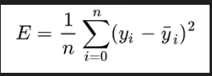

## Linear Regression
Linear regression is a statistical method used to model the relationship between two variables by fitting a linear equation to the observed data. It is commonly used in machine learning and data analysis to predict a continuous output variable based on one or more input variables.

## How it Works
The basic idea behind linear regression is to find the line of best fit that minimizes the distance between the predicted values and the actual values. This is done by calculating the slope and intercept of the line using a technique called least squares regression.

In simple linear regression, there is only one input variable, while in multiple linear regression, there are two or more input variables. The equation for simple linear regression is:

y = mx + b

where:

y is the output variable
x is the input variable
m is the slope of the line
b is the y-intercept
In multiple linear regression, the equation becomes:

y = b0 + b1x1 + b2x2 + ... + bnxn

where:

y is the output variable
x1, x2, ..., xn are the input variables
b0 is the y-intercept
b1, b2, ..., bn are the coefficients for each input variable
## Loss Function 
The loss is the error in our predicted value of m and b. Our goal is to minimize this error to obtain the most accurate value of m and b. We will use the mean square error function 

## Gradient Descent
Gradient descent is an optimization algorithm used to minimize the loss function in linear regression. It works by iteratively adjusting the values of m and b to find the values that minimize the loss.

The basic idea behind gradient descent is to calculate the gradient (i.e. derivative) of the loss function with respect to each parameter (m and b) and update the values of those parameters in the opposite direction of the gradient. This process is repeated until convergence (i.e. until the loss stops decreasing).

