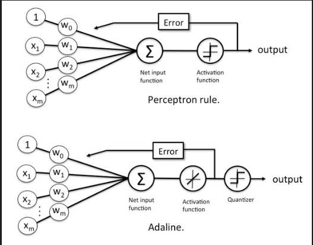

## Perceptron

Perceptron is a linear binary classifier that learns to separate two classes by updating its weights based on misclassification errors. It is a simple algorithm that works well for linearly separable datasets, but may not converge for datasets that are not linearly separable.

## Adaline

Adaline, which stands for Adaptive Linear Neuron, is also a linear binary classifier that learns to separate two classes. However, unlike Perceptron, it uses the continuous output of a linear function to compute errors and update weights. This allows Adaline to converge even for datasets that are not linearly separable.

##
The difference between the 2 algorithms is that the Perceptron uses the result of the threshold function g(z) to learn the model weights while Adaline uses the net input z (where the activation function is linear) to learn the model coefficients as illustrated below

