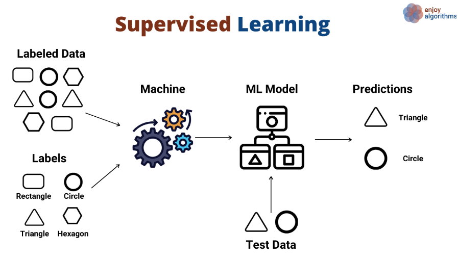

## Supervised Learning Course
This repository contains the code for the supervised learning course. In this course, I have implemented various algorithms from scratch, including:

- K-Fold Cross Validation
- Linear Regression
- Logistic Regression
- Neural Network
- Optimizers
- Regularization
- Perceptron VS. Adaline

